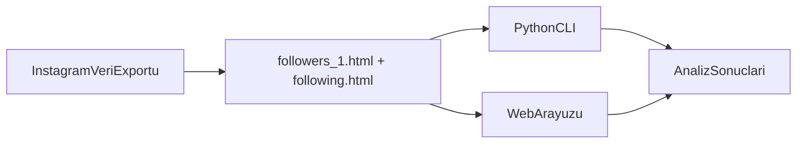

# Instagram Takipçi Analiz Aracı

> Instagram'dan indirdiğim takipçi verilerini elle karşılaştırmaktan yorulunca bu küçük aracı yazdım. Verileriniz bilgisayarınızdan çıkmaz — ne API ne scraping var, sadece sizin export ettiğiniz HTML dosyaları.

[](LICENSE)
[](https://www.python.org/)
[](https://github.com/dogukannparlak/instagram-analiz-araci)

---

## İçindekiler

- [Bu Proje Nedir?](#bu-proje-nedir)
- [Neden Yaptım?](#neden-yaptım)
- [Özellikler](#özellikler)
- [Nasıl Çalışır?](#nasıl-çalışır)
- [Hızlı Başlangıç](#hızlı-başlangıç)
- [Kurulum](#kurulum)
- [Kullanım](#kullanım)
- [Instagram Verilerini Alma](#instagram-verilerini-alma)
- [Proje Yapısı](#proje-yapısı)
- [Mimari Notlar](#mimari-notlar)
- [Gizlilik ve Güvenlik](#gizlilik-ve-güvenlik)
- [Sık Sorulan Sorular](#sık-sorulan-sorular)
- [Yol Haritası](#yol-haritası)
- [Katkıda Bulunma](#katkıda-bulunma)
- [Geliştirici](#geliştirici)
- [Lisans](#lisans)

---

## Bu Proje Nedir?

Instagram Takipçi Analiz Aracı, resmi Instagram veri export'unuzdan gelen HTML dosyalarını kullanarak takipçi ilişkilerinizi analiz eden **tamamen yerel** bir araçtır.

**Ne yapar:**
- Takipçilerinizi listeler
- Takip ettiklerinizi listeler
- Sizi geri takip etmeyenleri bulur
- Karşılıklı takip oranını hesaplar

**Ne yapmaz:**
- Instagram API'sine bağlanmaz
- Canlı profil taraması (scraping) yapmaz
- Verilerinizi herhangi bir sunucuya göndermez
- Başka birinin hesabını analiz etmez

**Kimler için uygun?**
- Kendi Instagram verilerini incelemek isteyen bireyler
- Takip/takipçi dengesini görmek isteyenler
- Gizliliğe önem veren, verilerini dışarı çıkarmak istemeyen kullanıcılar

---

## Neden Yaptım?

Instagram'ın "Verilerini İndir" özelliği takipçi ve takip listelerini HTML olarak veriyor. Ama "beni kim geri takip etmiyor?" sorusunun cevabını bulmak için iki dosyayı elle karşılaştırmak gerekiyordu. Binlerce satırlık HTML'de bunu yapmak hem yavaş hem sinir bozucu.

Bu projeyi tam da bu ihtiyaç için geliştirdim: küçük, bağımsız, açık kaynak ve mümkün olduğunca şeffaf. Hem terminalden hızlıca bakabileceğiniz CLI scriptleri, hem de tarayıcıda sürükle-bırak ile çalışan bir web arayüzü var.

---

## Özellikler

| Özellik | CLI (Python) | Web Arayüzü |
|---------|:------------:|:-----------:|
| Takipçi listesi | ✓ | ✓ |
| Takip edilenler listesi | ✓ | ✓ |
| Geri takip etmeyenler | ✓ | ✓ |
| Karşılıklı takip listesi | — | ✓ |
| Karşılıklı takip oranı | ✓ | ✓ |
| Arama / filtreleme | — | ✓ |
| Açık / koyu tema | — | ✓ |
| Sürükle-bırak dosya yükleme | — | ✓ |
| Klavye kısayolları | — | ✓ |
| Instagram profiline link | — | ✓ |

### Web arayüzü detayları

- Responsive tasarım (mobil ve masaüstü)
- Glassmorphism tabanlı modern arayüz
- İstatistik paneli: takipçi, takip, geri takip etmeyen ve karşılıklı takip sayıları
- Sekmeli listeler ve anlık arama
- Export rehberi (modal içinde adım adım anlatım)
- Klavye kısayolları:
  - `Ctrl/Cmd + K` — arama kutusuna odaklan
  - `Ctrl/Cmd + D` — tema değiştir
  - `Escape` — aramayı temizle

### CLI detayları

- Tek komutla hızlı analiz
- Anlaşılır hata mesajları (dosya yok, boş dosya, format sorunu)
- Örnek verilerle test desteği (`test.py`)

---

## Nasıl Çalışır?



1. Instagram'dan HTML formatında veri export edersiniz.
2. Export ZIP'inden `followers_1.html` ve `following.html` dosyalarını alırsınız.
3. CLI scriptleri bu dosyaları BeautifulSoup ile, web arayüzü ise tarayıcıda DOMParser ile okur.
4. Her iki yöntem de HTML içindeki `instagram.com` linklerinden kullanıcı adlarını çıkarır ve listeleri karşılaştırır.

---

## Hızlı Başlangıç

Projeyi henüz klonlamadıysanız, önce repoyu indirip bağımlılıkları kurun. Ardından örnek verilerle test edebilirsiniz — gerçek Instagram export'unuza gerek yok.

```bash
git clone https://github.com/dogukannparlak/instagram-analiz-araci.git
cd instagram-analiz-araci
pip install -r requirements.txt
python test.py
```

Test scripti `example_followers.html` ve `example_following.html` dosyalarını kullanarak üç CLI scriptini sırayla çalıştırır.

Web arayüzünü denemek için:

```bash
python -m http.server 8000 --directory web
```

Tarayıcıda [http://localhost:8000](http://localhost:8000) adresini açın ve HTML dosyalarınızı yükleyin.

---

## Kurulum

### Gereksinimler

- Python 3.9 veya üzeri
- pip
- Git (projeyi klonlamak için)

### Adımlar

```bash
git clone https://github.com/dogukannparlak/instagram-analiz-araci.git
cd instagram-analiz-araci
```

Sanal ortam kullanmanızı öneririm (opsiyonel ama iyi bir alışkanlık):

```bash
python -m venv .venv

# Windows
.venv\Scripts\activate

# macOS / Linux
source .venv/bin/activate
```

Bağımlılıkları yükleyin:

```bash
pip install -r requirements.txt
```

Kurulumu doğrulamak için:

```bash
python test.py
```

---

## Kullanım

### Web arayüzü

1. Sunucuyu başlatın:

   ```bash
   python -m http.server 8000 --directory web
   ```

2. Tarayıcıda `http://localhost:8000` adresine gidin.

3. `followers_1.html` ve `following.html` dosyalarını sürükleyip bırakın veya dosya seçici ile yükleyin.

4. Sonuçları sekmeler arasında gezerek inceleyin; arama kutusu ile filtreleyin.

VS Code kullanıyorsanız `.vscode/tasks.json` içindeki **Start Web Server** görevi aynı komutu çalıştırır.

### CLI komutları

HTML dosyalarını proje kök dizinine koyduktan sonra:

```bash
# Takipçileri listele (followers_1.html gerekli)
python takipçi.py

# Takip edilenleri listele (following.html gerekli)
python takip.py

# Geri takip etmeyenleri bul (her iki dosya gerekli)
python takipetmeyen.py

# Export klasöründeki tüm bağlantı dosyalarını analiz et
python baglantilar.py --dir /path/to/connections/followers_and_following
```

### Test scripti

Gerçek veriniz olmadan projeyi denemek için:

```bash
python test.py
```

Script önce bağımlılıkları ve gerekli dosyaları kontrol eder, ardından örnek HTML dosyalarıyla üç CLI scriptini çalıştırır. Mevcut `followers_1.html` veya `following.html` dosyalarınız varsa yedekleyip işlem sonunda geri yükler.

---

## Instagram Verilerini Alma

1. Instagram uygulamasını veya web sitesini açın.
2. **Ayarlar** → **Hesaplar Merkezi** → **Bilgilerin ve izinlerin** → **Bilgilerini dışa aktar** yolunu izleyin.
3. **Dışa aktarma oluştur** → **Cihaza aktar** seçeneğini tercih edin.
4. Özelleştirme adımında:
   - **Bağlantılar** (Connections) kategorisini dahil edin — takipçi ve takip listeleri burada.
   - Tarih aralığı: **Tüm zamanlar**
   - Format: **HTML**
5. Export hazır olunca ZIP dosyasını indirin ve açın.
6. İçinden şu dosyaları bulun:
   - `followers_1.html` (bazen `followers.html` olarak da gelebilir)
   - `following.html`

**CLI kullanımı:** Bu dosyaları proje kök dizinine kopyalayın.

**Web kullanımı:** Dosyaları tarayıcı arayüzüne yükleyin; proje klasörüne kopyalamanıza gerek yok.

> **Not:** Export süreci Instagram tarafında değişebilir. Menü isimleri farklı görünürse "Verilerini dışa aktar" / "Export your information" ifadesini arayın ve HTML + Bağlantılar seçimlerini koruyun.

---

## Proje Yapısı

```
instagram-analiz-araci/
├── README.md                 # Proje dokümantasyonu
├── CONTRIBUTING.md           # Katkı rehberi
├── LICENSE                   # MIT lisansı
├── requirements.txt          # Python bağımlılıkları
│
├── instagram_parser.py       # Paylaşılan çok formatlı HTML parser
├── takipçi.py                # CLI: takipçi listesi
├── takip.py                  # CLI: takip edilenler listesi
├── takipetmeyen.py           # CLI: geri takip etmeyenler + oran
├── baglantilar.py            # CLI: export klasörü analizi
├── test.py                   # Örnek verilerle test scripti
│
├── example_followers.html    # Test için örnek takipçi verisi (2026 format)
├── example_following.html    # Test için örnek takip verisi (2026 format)
├── example_table.html        # Test için tablo formatı örneği
│
└── web/                      # Statik web arayüzü
    ├── index.html
    ├── css/
    │   └── style.css
    └── js/
        └── script.js         # InstagramAnalyzer sınıfı
```

Kullanıcı tarafından sağlanan dosyalar (`followers_1.html`, `following.html`) repoya eklenmemelidir — `.gitignore` bunları hariç tutar.

---

## Mimari Notlar

### Veri çıkarma mantığı

Hem Python hem JavaScript tarafında aynı çok stratejili parser kullanılır:

1. `instagram.com` link metni
2. Link href (`/_u/` dahil)
3. `h2` başlıkları (following formatı)
4. Tablo satırları (`Kullanıcı adı` / `Username`)

Desteklenen export dosyaları: `followers_*.html`, `following.html`, `blocked_profiles.html`, `close_friends.html`, `removed_suggestions.html`, `pending_follow_requests.html`, `recent_follow_requests.html`, `recently_unfollowed_profiles.html`, `hide_story_from.html`

**Python (BeautifulSoup):**

```python
from instagram_parser import parse_export_file, parse_export_directory
result = parse_export_file("following.html")
data = parse_export_directory("connections/followers_and_following")
```

**JavaScript (DOMParser):**

```javascript
doc.querySelectorAll('a[href*="instagram.com"]')
```

### Format değişiklikleri

Instagram export HTML yapısını zaman zaman güncelleyebilir. Bu durumda scriptler boş liste döndürebilir veya uyarı verebilir. CLI tarafında "HTML dosyasının formatı değişmiş olabilir" mesajı gösterilir; web arayüzünde de benzer uyarılar vardır.

Sorun yaşarsanız issue açabilirsiniz — export dosyanızın yapısını paylaşırken **kişisel verilerinizi** (gerçek kullanıcı adları vb.) maskeleyin.

---

## Gizlilik ve Güvenlik

Bu araç **tamamen yerel** çalışır:

- Tüm analiz bilgisayarınızda (CLI) veya tarayıcınızda (web) gerçekleşir
- Instagram verileriniz hiçbir sunucuya gönderilmez
- API anahtarı, oturum bilgisi veya üçüncü taraf servis kullanılmaz
- Web arayüzü yalnızca Google Fonts ve Font Awesome CDN'lerini harici kaynak olarak yükler; analiz verisi dışarı çıkmaz

Kendi verilerinizi analiz etmek dışında bir amaçla kullanmayın. Instagram Kullanım Koşullarına uygun hareket etmek sizin sorumluluğunuzdadır.

---

## Sık Sorulan Sorular

### `followers.html` mi, `followers_1.html` mi?

Instagram export'unda dosya adı hesap sayısına göre değişebilir. CLI scriptleri varsayılan olarak `followers_1.html` bekler. Dosyanız `followers.html` ise ya adını değiştirin ya da scriptteki dosya yolunu güncelleyin. Web arayüzü her iki adı da kabul eder.

### Liste boş geliyor, ne yapmalıyım?

- Export sırasında **Bağlantılar** kategorisinin seçili olduğundan emin olun.
- Dosyanın boş olmadığını kontrol edin.
- Dosyayı bir metin editöründe açıp `instagram.com` linkleri olup olmadığına bakın.
- Instagram'ın HTML formatını değiştirmiş olma ihtimaline karşı issue açabilirsiniz.

### Başka birinin hesabını analiz edebilir miyim?

Hayır. Bu araç yalnızca **kendi** Instagram veri export'unuz için tasarlandı. Başkasının verilerini izinsiz analiz etmek hem etik değildir hem de Instagram kurallarına aykırı olabilir.

### Web arayüzü internete açık mı?

Hayır. `python -m http.server` komutu yalnızca yerel makinenizde (`localhost`) çalışır. Bilerek internete açmadığınız sürece dışarıdan erişilemez.

### CLI mı web mi kullanmalıyım?

- Hızlı terminal çıktısı istiyorsanız → CLI
- Görsel arayüz, arama, karşılıklı takip listesi istiyorsanız → Web

---

## Yol Haritası

Bu proje aktif bir side project. Aklımdaki bazı fikirler:

- [ ] Sonuçları CSV / JSON olarak dışa aktarma
- [ ] "Seni takip etmeyenler" listesi (ters yönlü analiz)
- [ ] GitHub Pages üzerinde statik demo
- [x] Instagram export format değişikliklerine daha dayanıklı parser
- [ ] CLI'ye karşılıklı takip listesi eklenmesi

Bir fikriniz veya bug bildiriminiz varsa [issue açmaktan](https://github.com/dogukannparlak/instagram-analiz-araci/issues) çekinmeyin.

---

## Katkıda Bulunma

Katkılarınızı memnuniyetle karşılarım — küçük düzeltmelerden yeni özelliklere kadar.

Detaylı rehber için [CONTRIBUTING.md](CONTRIBUTING.md) dosyasına bakın.

Kısa özet:
1. Repoyu fork edin
2. Yeni bir branch oluşturun
3. Değişikliklerinizi yapın ve test edin (`python test.py`)
4. Pull request açın

---

## Geliştirici

**Doğukan Parlak**

- GitHub: [@dogukannparlak](https://github.com/dogukannparlak)
- LinkedIn: [Doğukan Parlak](https://linkedin.com/in/dogukannparlak)

Bu projeyi kişisel bir ihtiyaçtan yola çıkarak geliştirdim. Faydalı bulduysanız repoya yıldız vermeniz beni mutlu eder.

---

## Lisans

Bu proje [MIT lisansı](LICENSE) altında lisanslanmıştır. Özgürce kullanabilir, değiştirebilir ve dağıtabilirsiniz.
